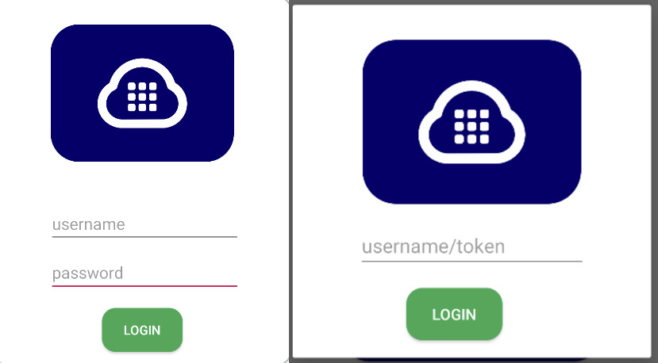
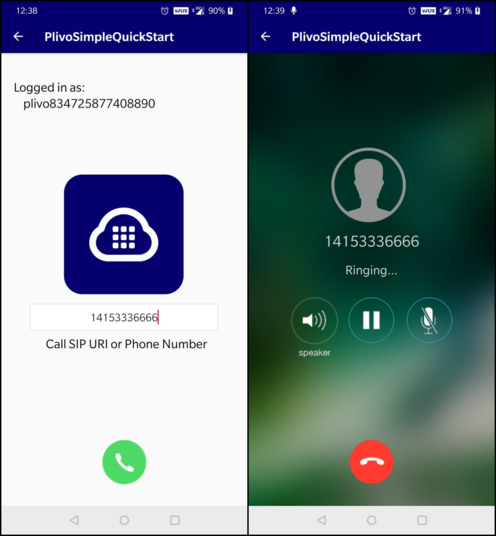

# Plivo Voice Quickstart for Android


### Introduction

The Plivo Android SDK v2 allows you to make outgoing and receive incoming calls in your Android application.
To get started with this quickstart application follow these steps.
- **Outgoing Call:** Follow the below steps to start making outbound calls
    - [Install the Plivo Android SDK using gradle](#bullet1)
    - [Create Endpoints](#bullet2)
    - [Register and Unregister Endpoint](#bullet3)
    - [Run the app](#bullet4)
    - [Making an outgoing call](#bullet5)
- **Incoming Call:** You can enable the application to receive incoming calls in the form of push notifications using Firebase.
    
    
### System Requirements

   - Android SDK supports x86, x86_64, arm64-v8a, armeabi-v7a architectures and Android OS 6 & above.
   - You can use Android Studio or Eclipse to build this quickstart app.
   - Plivo Android SDK supports IPv4 networks only. Users can make and receive calls when their device is connected to a network that uses IPv4 versions of the protocol.


### <a name="bullet1"></a> Install the Plivo Android SDK using gradle

It's easy to install the Android sdk if you manage your dependencies using gradle. Simply add the following to your build.gradle under app folder
```
implementation 'com.plivo.endpoint:endpoint:3.1.1-beta@aar'
```

[SDK Reference](https://www.plivo.com/docs/sdk/client/android/reference) - More documentation related to the Voice Android SDK


### Sign up for an account
Register [here](https://console.plivo.com/accounts/register/) to get your free Plivo account today.

Below are the steps that are to be followed to successfully Sign up for a free trial account.
1. Sign up with your corporate email address
2. You will receive an activation email from Plivo. Click on the link mentioned in the email to activate your account.
3. Enter an sms enabled, non-VOIP number to complete the phone verification.

Sign up with your corporate email address


If you are facing any issues while creating a Plivo account, you can reach out to our [Support Team](https://support.plivo.com/support/home)


### <a name="bullet2"></a> Create Endpoints

You can create an endpoint from the Plivo Console and assign an application to make and receive calls after configuring the endpoint in the quickstart app.


**Note:** You can make use of the demo 'Direct Dial' app in your account for the endpoint which will allow you to make and receive calls for testing purposes.


### <a name="bullet3"></a> Register and Unregister Endpoints


Implement SIP register to Plivo Communication Server

To register with Plivo's SIP and Media server , use a valid sip uri account from plivo web console 
```
private Endpoint endpoint;
Endpoint endpoint = Endpoint.newInstance(true, this);

// To register with SIP Server
public void login(String username, String password) {
   endpoint.login(username, password);
}

// To register with SIP Server using device token for getting Push Notifications
public void login(String username, String password, String fcmToken) {
   endpoint.login(username, password, fcmToken);
}

// To register with SIP Server using device token and certificate id
public void login(String username, String password, String fcmToken, String certificateId) {
   endpoint.login(username, password, fcmToken, certificateId);
}
```
#### With Access Tokens/ JWT
You can register an endpoint using:

- Access Token, device token, and certificate ID

```
public boolean loginWithJwtToken(String JWTToken, String deviceToken, String certificateId)
```

- Access Token, and device token

```
public boolean loginWithJwtToken(String JWTToken, String deviceToken)
```

- Access Token

```
public boolean loginWithJwtToken(String JWTToken)
```
- Access Token Generator

```
public boolean loginWithAccessTokenGenerator(AccessTokenListener accessTokenListener)
```

>Check out our [Github example](https://github.com/plivo/plivo-android-quickstart-app/tree/beta) for implementation.

If the registration to an endpoint succeeds the following interface method gets called
```
@Override
public void onLogin() {
   if (loginListener != null) loginListener.onLogin(true);
}
```

If the registration to an endpoint fails the following interface method gets called
```
@Override
public void onLoginFailed() {
   if (loginListener != null) loginListener.onLogin(false);
}
```

If the registration to an endpoint fails with JWT the following interface method gets called
```
@Override
public void onLoginFailed(String events) {
   if (loginListener != null) loginListener.onLogin(false);
}
```

Possible error events:
- INVALID_ACCESS_TOKEN
- INVALID_ACCESS_TOKEN_HEADER
- INVALID_ACCESS_TOKEN_ISSUER
- INVALID_ACCESS_TOKEN_SUBJECT
- ACCESS_TOKEN_NOT_VALID_YET
- ACCESS_TOKEN_EXPIRED
- INVALID_ACCESS_TOKEN_SIGNATURE
- INVALID_ACCESS_TOKEN_GRANTS
- EXPIRATION_EXCEEDS_MAX_ALLOWED_TIME
- MAX_ALLOWED_LOGIN_REACHED


When the user logs in with JWT and does not have the permission to make outgoing/receive incoming calls.
```
@Override
public void onPermissionDenied(String message) {
   Log.d(TAG,message); 
}
```


### <a name="bullet4"></a> Run the app
   - Clone the [repo](https://github.com/plivo/plivo-android-quickstart-app) and open plivo-android-quickstart-app.
   - Change sip endpoint username and password in [Utils](https://github.com/plivo/plivo-android-quickstart-app/blob/refactoring/app/src/main/java/com/plivo/plivosimplequickstart/Utils.java).
   - Build and run the app.  
   - After successful login make VoiceCalls.


### <a name="bullet5"></a> Making an outgoing call

###### Make an outgoing call with destination & headers:
Create PlivoOutgoingCall object , then make a call with destination and headers 
```
public Outgoing getOutgoing() {
    return endpoint.createOutgoingCall();
}
    
private void makeCall(String phoneNum) {
    Outgoing outgoing = ((App) getApplication()).backend().getOutgoing();
    if (outgoing != null) {
        outgoing.call(phoneNum);
    }
}
```

###### Make an outgoing call with destination:
Calling this method on the PlivoOutgoing object with the SIP URI would initiate an outbound call.
```
public boolean call(String dest);
```

###### Make an outgoing call with destination & custom SIP headers:
Calling this method on the PlivoOutgoing object with the SIP URI would initiate an outbound call with custom SIP headers.
```
public boolean callH(String dest, Map<String, String> headers);
```



### Receive an incoming call

To enable Pushkit Integration in the SDK:
Login with registerToken, create FirebaseMessagingService class and implement ```loginForIncomingWithUsername``` method
and ```loginForIncomingWithUsername```.
```
//Register with SIP server with device token using above mentioned method

//Create a FirebaseMessagingService class and call loginForIncoming  method
public class PlivoFCMService extends FirebaseMessagingService {
    @Override
    public void onMessageReceived(RemoteMessage remoteMessage) {
        super.onMessageReceived(remoteMessage);
        if (remoteMessage.getData() != null) {
            if (Pref.newInstance(getApplicationContext()).getBoolean(Constants.IS_LOGIN_WITH_TOKEN)) {
                    ((App) getApplication()).backend().loginForIncomingWithJwt(deviceToken, JWT_TOKEN, pushMap);
                } else if (isLoginWithTokenGenerator) {
                    ((App) getApplication()).backend().loginWithAccessTokenGenerator(pushMap);
                } else {
                ((App) getApplication()).backend().loginForIncomingWithUsername(username, password, deviceToken, "", pushMap);
            );
        }
    }
}
```


NOTE: ```relayIncomingPushData``` is now deprecated. Use ```loginForIncomingWithUsername``` method
and ``loginForIncomingWithUsername``


incomingData is the Map object forwarded by the firebase push notification. This will enable the application to receive incoming calls even the app is not in foreground.

incomingData is the Map object forwarded by the firebase push notification. This will enable the application to receive incoming calls even if the app is not in the foreground.

Please refer to this [guide](https://www.plivo.com/docs/sdk/client/android/reference#setting-up-push-notification) to learn about Generating VoIP Certificate


License

MIT
