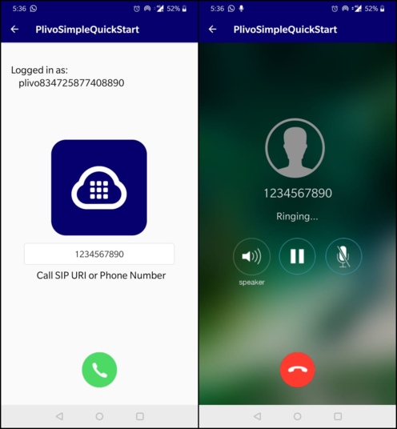

# Plivo Voice Quickstart for Android





The Plivo Android SDK v2 allows you to make outgoing and receive incoming calls in your Android application.

Compatible with Android version 6 and above.

Plivo Android SDK now supports IPv6 networks. Users can make and receive calls when their device is connected to a network that uses IPv4, IPv6, or both versions of the protocol.

To get started with the quickstart application follow these steps. Steps 1-3 will enable the application to make a call. The remaining steps 4-5 will enable the application to receive incoming calls in the form of push notifications using Firebase.

1. [Install the Plivo Android SDK using gradle](#bullet1)

2. [Create Endpoints](#bullet2)

3. [Register and Unregister Endpoint](#bullet3)

4. [Run the app](#bullet4)

5. [Plivo iOS SDK V2 with Push Kit integration](#bullet5)

6. [Making an outgoing call](#bullet6)

7. [Receive an incoming call](#bullet7)


### <a name="bullet1"></a>1. Install the Plivo Android SDK using gradle

It's easy to install the Android sdk if you manage your dependencies using gradle. Simply add the following to your build.gradle under app folder and remove the aar file under plivo-android-quickstart-app/app/libs:
```
// Replace 2.0.16 with latest version
implementation 'com.plivo.endpoint:endpoint:2.0.16@aar'
```
If you don't want to use gradle, simply build project since we already have aar file by default under plivo-android-quickstart-app/app/libs. 

[SDK Reference](https://www.plivo.com/docs/sdk/client/android/reference) - More documentation related to the Voice Android SDK

### <a name="bullet2"></a>2. Create Endpoints

Signup and create endpoints with Plivo using below link

[Plivo Dashboard](https://manage.plivo.com/accounts/login/)

### <a name="bullet3"></a>3. Register and Unregister Endpoints

Implement SIP register to Plivo Communication Server

To register with Plivo's SIP and Media server , use a valid sip uri account from plivo web console 
```
private Endpoint endpoint;
Endpoint endpoint = Endpoint.newInstance(true, this);

// To register with SIP Server
public void login(String username, String password) {
   endpoint.login(username, password);
}

// To register with SIP Server using device token for getting Push Notifications
public void login(String username, String password, String fcmToken) {
   endpoint.login(username, password, fcmToken);
}

// To register with SIP Server using device token and certificate id
public void login(String username, String password, String fcmToken, String certificateId) {
   endpoint.login(username, password, fcmToken, certificateId);
}

// To register with SIP Server using registration timeout
public void login(String username, String password, String regTimeout) {
   endpoint.login(username, password, regTimeout);
}

//To unregister with SIP Server
public void logout() {
   endpoint.logout();
}
```

If the registration to an endpoint succeeds the following delegate gets called 
```
@Override
public void onLogin() {
   if (loginListener != null) loginListener.onLogin(true);
}
```

If the registration to an endpoint fails the following delegate gets called 
```
@Override
public void onLoginFailed() {
   if (loginListener != null) loginListener.onLogin(false);
}
```

### <a name="bullet4"></a>4. Run the app

Clone and open plivo-android-quickstart-app. 

Change sip endpoint username and password in [Utils](https://github.com/plivo/plivo-android-quickstart-app/blob/refactoring/app/src/main/java/com/plivo/plivosimplequickstart/Utils.java).

Build and run the app.  

After successful login make VoiceCalls.


### <a name="bullet5"></a>5. Plivo Android SDK V2 with Push Kit integration

To enable Pushkit Integration in the SDK:
login with registerToken, create FirebaseMessagingService class and implement relayVoipPushNotification method
```
//Register pushkit token using the login method as mentioned above
public void login(String username, String password, String fcmToken) {
   endpoint.login(username, password, fcmToken);
}

//Create a FirebaseMessagingService class and call relayIncomingPushData method
public class PlivoFCMService extends FirebaseMessagingService {
    @Override
    public void onMessageReceived(RemoteMessage remoteMessage) {
        super.onMessageReceived(remoteMessage);
        if (remoteMessage.getData() != null) {
            ((App) getApplication()).backend().relayIncomingPushData(new HashMap<>(remoteMessage.getData()));
            startActivity(new Intent(this, MainActivity.class)
                    .addFlags(Intent.FLAG_ACTIVITY_NEW_TASK)
            );
        }
    }
}

//receive and pass on (incoming call information or a message) to SDK using relayVoipPushNotification method.
public void relayIncomingPushData(HashMap<String, String> incomingData) {
    if (incomingData != null && !incomingData.isEmpty()) {
        endpoint.relayVoipPushNotification(incomingData);
    }
}
```
please refer to below link on Generating VoIP Certificate. 

[Generating VoIP Certificate](https://www.plivo.com/docs/sdk/client/android/reference#setting-up-push-notification)


### <a name="bullet6"></a>5. Making an outgoing call

Create PlivoOutgoingCall object , then make a call with destination and headers 
```
public Outgoing getOutgoing() {
    return endpoint.createOutgoingCall();
}
    
private void makeCall(String phoneNum) {
    Outgoing outgoing = ((App) getApplication()).backend().getOutgoing();
    if (outgoing != null) {
        outgoing.call(phoneNum);
    }
}
```

Make an outbound call

Calling this method on the PlivoOutgoing object with the SIP URI
would initiate an outbound call.
```
public boolean call(String dest);
```

Make an outbound call with custom SIP headers

Calling this method on the PlivoOutgoing object with the SIP URI
would initiate an outbound call with custom SIP headers.
```
public boolean callH(String dest, Map<String, String> headers);
```


### <a name="bullet7"></a>6. Receive an incoming call

To enable Pushkit Integration in the SDK:
Login with registerToken, create FirebaseMessagingService class and implement relayVoipPushNotification method
```
//Register pushkit token using the login method as mentioned above
public void login(String username, String password, String fcmToken) {
   endpoint.login(username, password, fcmToken);
}

//Create a FirebaseMessagingService class and call relayIncomingPushData method
public class PlivoFCMService extends FirebaseMessagingService {
    @Override
    public void onMessageReceived(RemoteMessage remoteMessage) {
        super.onMessageReceived(remoteMessage);
        if (remoteMessage.getData() != null) {
            ((App) getApplication()).backend().relayIncomingPushData(new HashMap<>(remoteMessage.getData()));
            startActivity(new Intent(this, MainActivity.class)
                    .addFlags(Intent.FLAG_ACTIVITY_NEW_TASK)
            );
        }
    }
}

//receive and pass on (incoming call information or a message) to SDK using relayVoipPushNotification method.
public void relayIncomingPushData(HashMap<String, String> incomingData) {
    if (incomingData != null && !incomingData.isEmpty()) {
        endpoint.relayVoipPushNotification(incomingData);
    }
}

incomingData is the Map object forwarded by the firebase push notification. This will enable the application to receive incoming calls even the app is not in foreground.
```
please refer to below link on Generating VoIP Certificate. 
[Generating VoIP Certificate](https://www.plivo.com/docs/sdk/client/android/reference#setting-up-push-notification)

You are now ready to receive incoming calls. 

License

MIT
